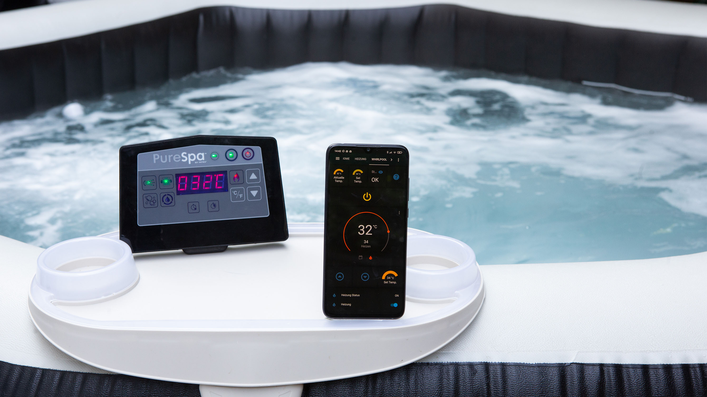
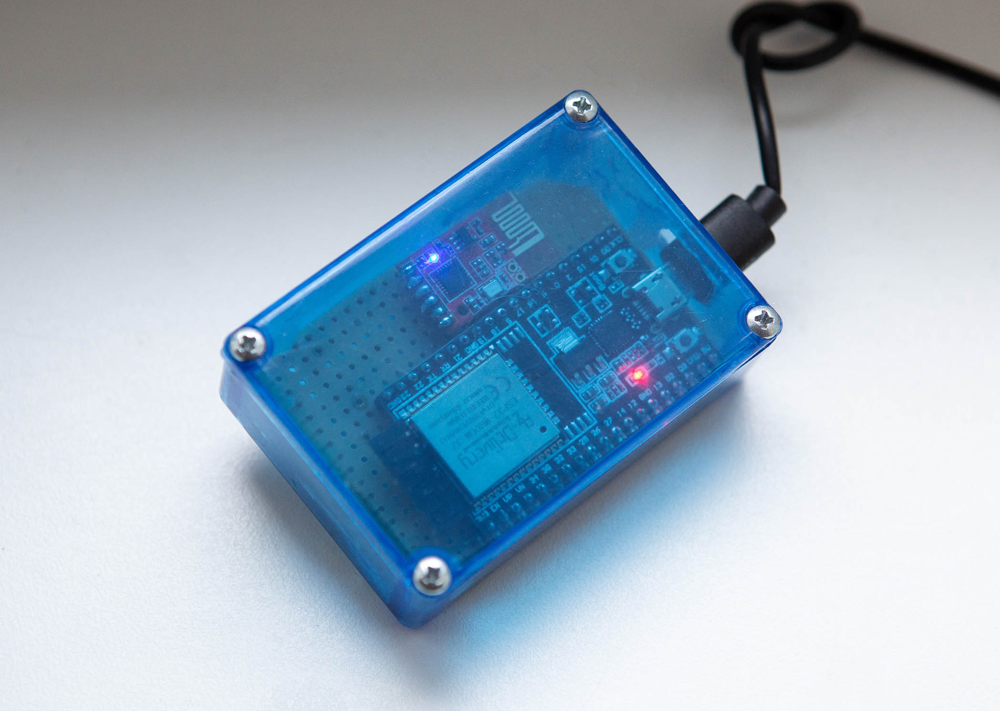

# Intex® PureSpa remote control for Home Automation

**Control your PureSpa over MQTT or MySensors *(comming soon)*** for  **#28458, #28462 & #28442, #28440**. 
No hardware modification and used with Smart Home (optimized for [Jeedom](www.jeedom.com) & [Home Assistant](https://www.home-assistant.io)).

## Pictures & Videos

-------

- [Video - Controlling in Action](https://youtu.be/uz7ssMk9tW4)
- [Video - Home Assistant - Screen Recording ](https://youtu.be/5Z1keongL40)
- [Video - Box LC12s & ESP32](https://youtu.be/aqid8pSHN-g)

## Hardware to you need

-   **ESP32 Dev Kit C V4**  (Microcontroller) -  [amazon.de](https://amzn.to/3uoa2y4) or [amazon.fr](https://amzn.to/2RvXbLn)
-   **LC12s**  (Wire modul, [Manuel about the Chip](Docs/H2-LCS12.pdf)) -  [amazon.de](https://amzn.to/3eZeOvb) or [amazon.fr](https://amzn.to/3eokz6R)  or  [aliexpress](https://de.aliexpress.com/item/4001201940321.html?spm=a2g0o.productlist.0.0.488361e7d3jNj7&algo_pvid=0319d211-c29a-4aef-ba9c-feb4d60fade2&algo_expid=0319d211-c29a-4aef-ba9c-feb4d60fade2-1&btsid=0b0a555616134100516381178e3281&ws_ab_test=searchweb0_0,searchweb201602_,searchweb201603) 
-   **Arduino Uno**  (for MySensors only) -  [amazon.de](https://amzn.to/3nTdAWm)

## Software to you need

-   [**Arduino IDE**](https://www.arduino.cc/en/software)
-   **Install the “[ESP32 Dev Kit C V4](https://www.silabs.com/developers/usb-to-uart-bridge-vcp-drivers)” Board for Arduino IDE**  ->  [Screenshot](Docs/Image/Board-Screenshot-IDE.PNG)
-   **Install the following libraries**  (use the Arduino Library Manager)
    -   EspMQTTClient
    -   arduino-timer
    -   WiFi
    -   ESPmDNS
    -   ArduinoOTA
    -   SoftwareSerial (only for Arduino)
    -   MySensors (only supported for Arduino)
-   **You need a MQTT broker**  (e.g. Mosquitto Broker)

## Pinouts

| LC12S | ESP32 | Arduino |
|-------|-------|---------|
| GND   | GND   | GND     |
| CS    | D18   | D5      |
| SET   | D19   | D6      |
| TX    | D16   | D2      |
| RX    | D17   | D4      |
| VCC   | 3.3V  | 3.3V    |


## Channel and Network id detection

The channel and the network id are unique for each spa, specialy the network id. Unfortunately, I am not yet able to read these parameters from the pump controller.
But I write some help software for that.

-  **Channel detection**  
**This detection can take up to 3 minutes.**
    -   [Download](src/Tools/SearchChannel) the channel detection code
    -   Upload the code to your ESP32 or Arduino
    -   Open the Arduino Ide Serial Monitor (speed 115200 baud), the actual channel configuration is diplayed (in hexadecimal)
    -   Look at the LC12s LED, when the right channel is detected it will flash faster see the [video](Docs/Video/ChannelSearchBlink.mp4) 
    -   Note the actual channel configuration, you will need it for the Network id detection

-  **Network id detection.**  
**This detection can take up to 36 hours.**  
    -   [Download](src/Tools/SearchNetworkId/) the network id detection code
    -   Write then channel (in Hexadecimal) you note befor here  
	```
	uint8_t Channel =yourchanel; //(for example 0x37) 
	```  
    -   Upload the code to your ESP32 or Arduino
    -   Look at the LC12s LED, when you use the right channel it will flash fast see the [video](Docs/Video/RightChannel.mp4). If the LED doesn't flash try some channel befor and/or after until the LED flash. If the LED doen't flash her you will not be able to find a network id.
    -   Download [PuTTY](https://www.putty.org/) and configure it to [log serial port inside a file](https://www.eye4software.com/hydromagic/documentation/articles-and-howtos/serial-port-logging/) under Linux you can also use [grabserial](https://elinux.org/Grabserial). Of course you can use other tool wo are able to save serial comunication inside a file. With the Arduino Serial Monitor I make bad experiance when he is open 36 hours.
    -   Uncomment following line
	```
        //#define SEARCH_NETWORK_ID	
	```  
    -   Upload the code to your ESP32 or Arduino
    -   Wait untill the right network id is founded **this can take up to 36 hours.** It will be displayed on your Serial Monitor software and save into the file.

## PureSpa Software
Now you can [Download](src/Spa/) the PureSpa code change it to your settings and upload it to your ESP or Arduino

##  Channel and Network id configuration
**Put the Channel and Network id you found previously here (in hexadecimal)**
```
#define USED_NETWORK_ID    0xFFFF
#define USED_CHANNEL       0x48
```

## Choose your PureSpa model

**Uncomment one line for your Spa**
```
//#define _28458_28462_
//#define _28442_28440_
```
## MQTT communication protocol

**Write your WIFI settings in this lines**

```
const char* Myssid = "YourSSID";
const char* Mypassword = "YourPassword";
```

----------

**Write your MQTT settings in this lines**

```
"YourMQTT-Broker-IP", 	  // MQTT Broker server ip
"NameMQTTBroker",        // Can be omitted if not needed
"PasswordMQTTBroker",   // Can be omitted if not needed
"IntexSpa",            // Client name that uniquely identif your device. Don't change the name!
 1883                 // The MQTT port, default to 1883. this line can be omitted
```

----------

**MQTT topic & payload**

-   Topic is the path to communtions over MQTT:  
    e.g.:  _**IntexSpa/Cmd Power on off**_
-   Payload is the command 


| Description                  | Topic String                     | Payload | Payload | Only Status           |
|------------------------------|----------------------------------|---------|---------|-----------------|
| **Power**                    | IntexSpa/Cmd Power on off        | ON=1    | OFF=0   | -               |
| **Water Filter**             | IntexSpa/Cmd water filter on off | ON=1    | OFF=0   | -               |
| **Water Filter Timer**        | IntexSpa/Cmd water filter time   | hours=2,4,6       | -   | -               |
| **Bubble**                   | IntexSpa/Cmd bubble on off       | ON=1    | OFF=0   | -               |
| **Heater**                   | IntexSpa/Cmd heater on off       | ON=1    | OFF=0   | -               |
| **Change Farenheit/Celsius** | IntexSpa/Cmd Farenheit Celsius   | F=1     | C=0     | -               |
| **Decrease the Temp.**       | IntexSpa/Cmd decrease            | UP=1    | -       | -               |
| **Increase the Temp.**       | IntexSpa/Cmd increase            | Down=1  | -       | -  
| **ESP Reset**                | IntexSpa/Cmd Reset ESP            | reset | -       | -             |  
| **Command Setpoint of Temp.**       | IntexSpa/Cmd Temperature Setpoint| "set a number"  | -       | -
| **Status Communication with pump**| IntexSpa/Communication with pump | Com/OK=1   | 0=lost connection       | -   |Yes           |
| **Heater Status**                   | IntexSpa/heater state       | standby=1 & ON=2  | OFF=0    | Yes
| **Status Setpoint Temp.**         | IntexSpa/Temperature Setpoint    | -       | -       | Yes
| **Send °F Temp.**     | IntexSpa/Farenheit Celsius       | -       | -       | Yes             |             |
| **Send Actual Temp.**        | IntexSpa/Actual Temperature      | -       | -       | Yes             |
| **Send Error Message**       | IntexSpa/Error Number            | -       | -       | Yes             |
| **Status Power on**          | IntexSpa/Power on                | -       | -       | Yes             |  
| **Status Bubble on**         | IntexSpa/Bubble on               | -       | -       | Yes             |  
| **Status Heater on**         | IntexSpa/heater on               | -       | -       | Yes             |  
| **Status Filter on**         | IntexSpa/filter on               | -       | -       | Yes             |
| **Status Filter Timer**         | IntexSpa/filter setup time               | -       | -       | Yes             |    


***Only for Spa #28458 #28462***

| Description | Topic String                   | Payload | Payload | Only Status          |
|-------------|--------------------------------|---------|---------|-----------------|
| **Water Jet**             |  IntexSpa/Cmd water jet on off | ON=1    | OFF=0   | -               |
| **Sanitizer**               | IntexSpa/Cmd sanitizer on off    | ON=1    | OFF=0   | -               |
| **Status Water Jet**      | IntexSpa/Water jet on          | -       | -       | Yes             |
| **Sanitizer Timer**               | IntexSpa/Cmd Sanitizer time    | hours=3,5,8    | -  | -               |
| **Status Sanitizer**        | IntexSpa/Sanitizer on            | -       | -       | Yes             |
| **Status Sanitizer Timer**        | IntexSpa/Sanitizer setup time            | -       | -       | Yes             |


## Debugging

You can debug on Arduino IDE with serial print on  **baud rate: 115200**

Options to debug  
_Uncomment to debug_  

	//#define DEBUG_RECIEVED_DATA
	//#define DEBUG_SEARCH_CHANNEL
	//#define DEBUG_SEND_COMMAND
	//#define DEBUG_PUMP_DATA
	//#define DEBUG_CONTROLER_DATA
	//#define DEBUG_CONFIG
	//#define DEBUG_MQTT
	//#define DEBUG_SEND_VALUE_TO_HOME_AUTOMATION_SW

## OTA update

You can use OTA update (wireless) via Arduino IDE after the first upload via USB.  [Screenshot](Docs/Image/Screenshot-OTA.PNG)

## Changing ID and automatically search

After the correct selection of the model (see point: Choose your PureSpa model) and after the first start, 
a channel search is performed (slow blinking of the LC12s). After a successful search (fast blinking of the LC12s) the channel is stored in the ESP (EEPROM), this can take up to 10 minutes.

After the next start the memory is read out and checked if the channel is correct.
1. If yes, then the code is continued.
2. If no, then a new search is started until a channel is found.

**Please note:** It can happen from time to time that the channel changes. You can see the channel search in debug (#define DEBUG_SEARCH_CHANNEL).

For more infos regarding the configuration from the LC12s, can you see it in the code comments and [manuel of the LC12s](Docs/H2-LCS12.pdf)

## Home Assistant
Is a powerful open source home automation software. [www.home-assistant.io](https://www.home-assistant.io)

You can use it as you want, I'll show you an example of a part of the files configuration.yaml and automations.yaml


**Screenshot & Video:**
1. [OFF - Whrilpool Screenshot](Docs/Image/1.HomeAssistant-OFF_Screenshot.jpg) 
2. [ON - Whrilpool Screenshot](Docs/Image/2.HomeAssistant-ON_Screenshot.jpg)
3. [Help/Infos/Reset Screenshot](Docs/Image/3.HomeAssistant-Help-Infos_Screenshot.jpg)
4. [Heat Timer](Docs/Image/4.HomeAssistant-Timer_Screenshot.jpg)
5. [Push-notification Screenshot](Docs/Image/5.HomeAssistant-Push-notification_Screenshot.jpg)
6. [Video - Screen Recording ](https://youtu.be/5Z1keongL40)


**Config of Home Assistant:** 
- [**configuration.yaml**](src/HomeAutomation/HomeAssistant/configuration.yaml)
   - Define the switches and sensors with MQTT Topics and Payload.

- [**automations.yaml**](src/HomeAutomation/HomeAssistant/automations.yaml) **(optional)**

  - All your automation settings such as push-notification on your mobile phone.


## Jeedom 

Is a powerful and innovative open source home automation software. [www.jeedom.com](https://jeedom.com/)

**Screenshot & Video:**
1. [Screenshot dashboard view](Docs/Image/10.Jeedom-Dashboard.png)
2. [Wiring video](https://www.youtube.com/watch?v=50lxF08o_vo) thanks [@Dim](https://github.com/jeedom-help-Dim-Ant)
3. Configuration video **comming soon**.


**Config of Jeedom:** 

Template for the MQTT topics are available inside the beta version from the jeedom plugin jMQTT

**On jeedom Community thread:** 

you can found some information/help (in french) on the [Jeedom Community thread](https://community.jeedom.com/t/intex-purespa-avec-commande-sans-fils/59334)


## The official Intex® PureSpa instructions

| Articel No. | English  | German   |
|-------------|----------|----------|
| 28462 & 28458      | [Download](Docs/28462-28458_344IO_202_EN_.pdf) | [Download](Docs/28462_28458_344IO_2020_DE.pdf) |
| 28442 & 28440       | [Download](Docs/28442-28440_346IO_2020_EN.pdf) | [Download](Docs/28442_28440_346IO_2020_DE.pdf) |


## Known issues
-  **MySensors isn't implemented** 


**Thanks [@LEECHER1](https://github.com/LEECHER1) for this documentation and all test he do**

