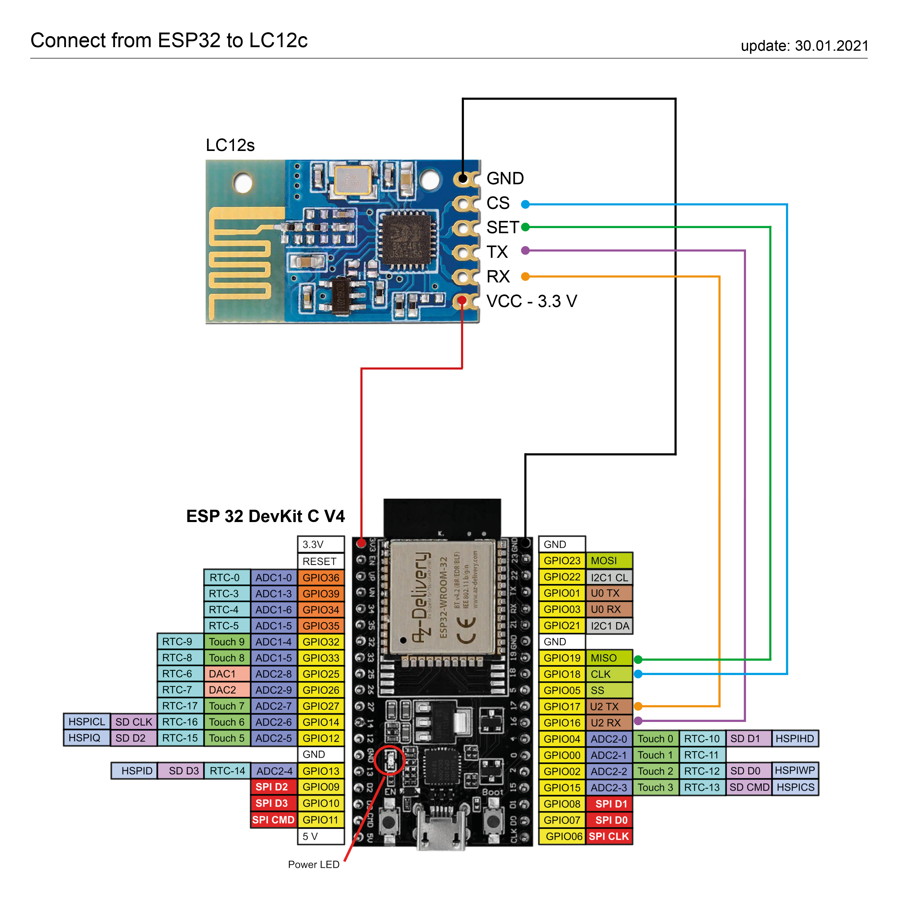

# Intex® PureSpa remote controll for Home Automation

**Controll your PureSpa over MQTT or Mysensors** for  **#28458, #28462 & #28442, #28440**. 
No hardware modification and used with Smart Home (optimized for [Jeedom](www.jeedom.com) & [Home Assistant](https://www.home-assistant.io)).

Need Help? Join  [Whaller](https://whaller.com/sphere/aixade)

## Pictures & Videos

- [Video - Home Assistant - Screen Recording ](https://youtu.be/M_iNxbb4UTU)
 
More Videos and pictures coming soon... 

## Hardware to you need

-   **ESP32 Dev Kit C V4**  (Microcontroller) -  [amazon.de](https://www.amazon.de/AZDelivery-ESP32-NodeMCU-gratis-eBook/dp/B07Z83MF5W/ref=sr_1_4?__mk_de_DE=%C3%85M%C3%85%C5%BD%C3%95%C3%91&dchild=1&keywords=ESP32&qid=1613410149&sr=8-4)
-   **LC12s**  (Wire modul, [Manuel about the Chip](Docs/H2-LCS12.pdf)) -  [amazon.de](https://www.amazon.de/LC12S-Wireless-serielle-transparente-Transmition/dp/B07JDN3QL7/ref=sr_1_1?__mk_de_DE=%C3%85M%C3%85%C5%BD%C3%95%C3%91&dchild=1&keywords=lc12s&qid=1613409977&sr=8-1)  or  [aliexpress](https://de.aliexpress.com/item/4001201940321.html?spm=a2g0o.productlist.0.0.488361e7d3jNj7&algo_pvid=0319d211-c29a-4aef-ba9c-feb4d60fade2&algo_expid=0319d211-c29a-4aef-ba9c-feb4d60fade2-1&btsid=0b0a555616134100516381178e3281&ws_ab_test=searchweb0_0,searchweb201602_,searchweb201603)
-   **Arduino Uno**  (for Mysensors only) -  [amazon.de](https://www.amazon.de/Arduino-Uno-Rev-3-Mikrocontroller-Board/dp/B008GRTSV6/ref=sr_1_3?__mk_de_DE=%C3%85M%C3%85%C5%BD%C3%95%C3%91&dchild=1&keywords=Arduino%20Uno&qid=1613414774&quartzVehicle=35-163&replacementKeywords=arduino&sr=8-3)

## Software to you need

-   [**Arduino IDE**](https://www.arduino.cc/en/software)
-   **Install the “[ESP32 Dev Kit C V4](https://www.silabs.com/developers/usb-to-uart-bridge-vcp-drivers)” Board for Arduino IDE**  ->  [Screenshot](Docs/Image/Board-Screenshot-IDE.PNG)
-   **Install the following libraries**  (use the Arduino Library Manager)
    -   EspMQTTClient
    -   arduino-timer
    -   WiFi
    -   ESPmDNS
    -   ArduinoOTA
    -   SoftwareSerial (only for Arduino)
    -   MySensors (only supported for Arduino)
-   **You need a MQTT broker**  (e.g. Mosquitto Broker)
-   **[Download](Code/Spa/Spa.ino) the PureSpa code and change it to your settings**

## Pinouts

| LC12S | ESP32 | Arduino |
|-------|-------|---------|
| GND   | GND   | GND     |
| CS    | D18   | D5      |
| SET   | D19   | D6      |
| TX    | D16   | D2      |
| RX    | D17   | D4      |
| VCC   | 3.3V  | 3.3V    |




## Choose your PureSpa model

**Uncomment one line for your Spa**
```
//#define _28458_28462_
//#define _28442_28440_
```
## MQTT communication protocol

**Write your WIFI settings in this lines**

```
const char* Myssid = "YourSSID";
const char* Mypassword = "YourPassword";
```

----------

**Write your MQTT settings in this lines**

```
"YourMQTT-Broker-IP", 	  // MQTT Broker server ip
"NameMQTTBroker",        // Can be omitted if not needed
"PasswordMQTTBroker",   // Can be omitted if not needed
"IntexSpa",            // Client name that uniquely identif your device. Don't change the name!
 1883                 // The MQTT port, default to 1883. this line can be omitted
```

----------

**MQTT topic & payload**

-   Topic is the path to communtions over MQTT:  
    e.g.:  _**IntexSpa/Cmd Power on off**_
-   Payload is the command 


| Description                  | Topic String                     | Payload | Payload | Only Status           |
|------------------------------|----------------------------------|---------|---------|-----------------|
| **Power**                    | IntexSpa/Cmd Power on off        | ON=1    | OFF=0   | -               |
| **Water Filter**             | IntexSpa/Cmd water filter on off | ON=1    | OFF=0   | -               |
| **Bubble**                   | IntexSpa/Cmd bubble on off       | ON=1    | OFF=0   | -               |
| **Heater**                   | IntexSpa/Cmd heater on off       | ON=1    | OFF=0   | -               |
| **Change Farenheit/Celsius** | IntexSpa/Cmd Farenheit Celsius   | F=1     | C=0     | -               |
| **Decrease the Temp.**       | IntexSpa/Cmd decrease            | UP=1    | -       | -               |
| **Increase the Temp.**       | IntexSpa/Cmd increase            | Down=1  | -       | -  
| **Status Communication with pump**| IntexSpa/Communication with pump | Com/OK=1   | 0=lost connection       | -   |              |
| **ESP Reset**                | IntexSpa/Cmd Reset ESP            | reset | -       | -             |  
| **Command Setpoint of Temp.**       | IntexSpa/Cmd Temperature Setpoint| "set a number"  | -       | -
| **Status Setpoint Temp.**         | IntexSpa/Temperature Setpoint    | -       | -       | Yes
| **Send °C/°F Temp.**     | IntexSpa/Farenheit Celsius       | -       | -       | Yes             |             |
| **Send Actual Temp.**        | IntexSpa/Actual Temperature      | -       | -       | Yes             |
| **Send Error Message**       | IntexSpa/Error Number            | -       | -       | Yes             |
| **Status Power on**          | IntexSpa/Power on                | -       | -       | Yes             |  
| **Status Bubble on**         | IntexSpa/Bubble on               | -       | -       | Yes             |  
| **Status Heater on**         | IntexSpa/heater on               | -       | -       | Yes             |  
| **Status Filter on**         | IntexSpa/filter on               | -       | -       | Yes             |  

IntexSpa/Cmd Temperature Setpoint
***Only for Spa #28458 #28462***

| Description | Topic String                   | Payload | Payload | Only Status          |
|-------------|--------------------------------|---------|---------|-----------------|
| **Water Jet**             |  IntexSpa/Cmd water jet on off | ON=1    | OFF=0   | -               |
| **Sanizer**               | IntexSpa/Cmd sanizer on off    | ON=1    | OFF=0   | -               |
| **Status Water Jet**      | IntexSpa/Water jet on          | -       | -       | Yes             |
| **Status Sanizer**        | IntexSpa/Sanizer on            | -       | -       | Yes             |


## Debugging

You can debug on Arduino IDE with serial print on  **baud rate: 115200**

Options to debug  
_Uncomment to debug_  

	//#define DEBUG_RECIEVED_DATA
	//#define DEBUG_SEARCH_CHANNEL
	//#define DEBUG_SEND_COMMAND
	//#define DEBUG_PUMP_DATA
	//#define DEBUG_CONTROLER_DATA
	//#define DEBUG_CONFIG
	//#define DEBUG_MQTT
	//#define DEBUG_SEND_VALUE_TO_HOME_AUTOMATION_SW

## OTA update

You can use OTA update (wireless) via Arduino IDE after the first upload via USB.  [Screenshot](Docs/Image/Screenshot-OTA.PNG)

## Changing ID and automatically search

After the correct selection of the model (see point: Choose your PureSpa model) and after the first start, 
a channel search is performed (slow blinking of the LC12s). After a successful search (fast blinking of the LC12s) the channel is stored in the ESP (EEPROM), this can take up to 10 minutes.

After the next start the memory is read out and checked if the channel is correct.
1. If yes, then the code is continued.
2. If no, then a new search is started until a channel is found.

**Please note:** It can happen from time to time that the channel changes. You can see the channel search in debug (#define DEBUG_SEARCH_CHANNEL).

For more infos regarding the configuration from the LC12s, can you see it in the code comments and [manuel of the LC12s](Docs/H2-LCS12.pdf)

## Home Assistant
Is a powerful open source home automation software. [www.home-assistant.io](https://www.home-assistant.io)

You can use it as you want, I'll show you an example of a part of the files configuration.yaml and automations.yaml


**Screenshot & Video:**
1. [OFF - Whrilpool Screenshot](Docs/Image/1.HomeAssistant-OFF_Screenshot.jpg) 
2. [ON - Whrilpool Screenshot](Docs/Image/2.HomeAssistant-ON_Screenshot.jpg)
3. [Help/Infos/Reset Screenshot](Docs/Image/3.HomeAssistant-Help-Infos_Screenshot.jpg)
4. [Heat Timer](Docs/Image/4.HomeAssistant-Timer_Screenshot.jpg)
5. [Push-notification Screenshot](Docs/Image/5.HomeAssistant-Push-notification_Screenshot.jpg)
6. [Video - Screen Recording ](https://youtu.be/M_iNxbb4UTU)


**Config of Home Assistant:** 
- [**configuration.yaml**](Code/HomeAutomation/HomeAssistant/configuration.yaml)
   - Define the switches and sensors with MQTT Topics and Payload.

- [**automations.yaml**](Code/HomeAutomation/HomeAssistant/automations.yaml) **(optional)**

  - All your automation settings such as push-notification on your mobile phone.


## Jeedom

## The official Intex® PureSpa instructions

| Articel No. | English  | German   |
|-------------|----------|----------|
| 28462 & 28458      | [Download](Docs/28462-28458_344IO_202_EN_.pdf) | [Download](Docs/28462_28458_344IO_2020_DE.pdf) |
| 28442 & 28440       | [Download](Docs/28442-28440_346IO_2020_EN.pdf) | [Download](Docs/28442_28440_346IO_2020_DE.pdf) |

thanks [@LEECHER1](https://github.com/LEECHER1) for this documentation and all test he do
